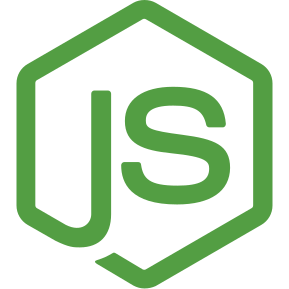

### Hi there, I'm Braeden Sowinski - aka [McDazzzled][website] 👋

I'm an ambitious student pursuing a Computer Science degree,
eager to contribute developed knowledge in Software
Engineering or API development. Skilled in Python, JavaScript,
Go and the MongoDB service. I also know the basics of the three
C languages and Java. I am an avid computer programmer,
adaptable and driven with a strong work ethic and motivation to
thrive in a team-based or individually motivated setting.

### Connect with me:

[][website]
[][twitter]
[][instagram]
[][discord]

 

### Languages and Tools:

[website]: https://mcdazzzled.com/
[twitter]: https://twitter.com/BraedenSowinski/
[instagram]: https://instagram.com/nedearb_iksniwos/
[discord]: https://discord.com/invite/w2g2FFmHbF
